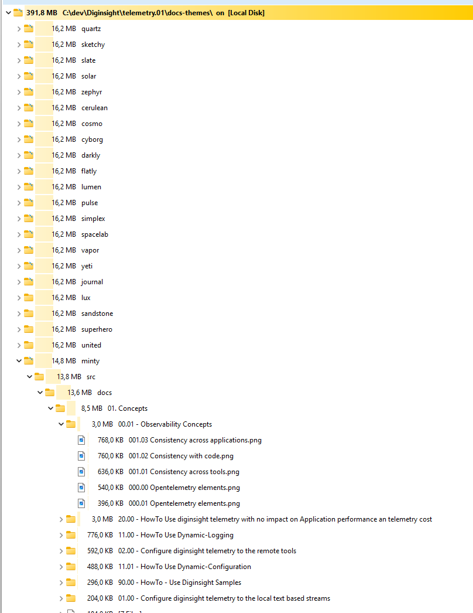

the size of the quarto site explodes because of the large nummber of images and content that is repeated in all theme folders 

## Root cause

`build-theme-previews.ps1` rendered the **entire** site (all pages + images, ~16 MB)
once per Bootswatch theme into `docs-themes/<theme>/`. With 25 themes that is ~390 MB
of byte-for-byte identical content. The only thing that actually differs between
themes is the compiled `bootstrap.min.css` (colors + fonts).

## Solution

Yes — a single base folder with per-theme color/font directives is feasible, and the
runtime switcher in `header-includes.html` already proves it: the published `docs/`
site loads every Bootswatch palette on demand from a CDN, with no duplicated content.

The fix applies the same idea to the comparison preview:

- **`build-theme-previews.ps1`** now renders the site **once** into `docs-themes/site/`
  and writes a `docs-themes/index.html` whose cards deep-link each palette via
  `./site/Index.html?theme=<name>`.
- **`header-includes.html`** `read()` now honours a `?theme=<name>` query parameter,
  so the single base render can be shown under any theme.

Result: `docs-themes/` drops from ~390 MB (25 copies) to ~16 MB (one copy) plus 25
trivial query-string links. Themes still differ only by font and color, applied at
runtime.