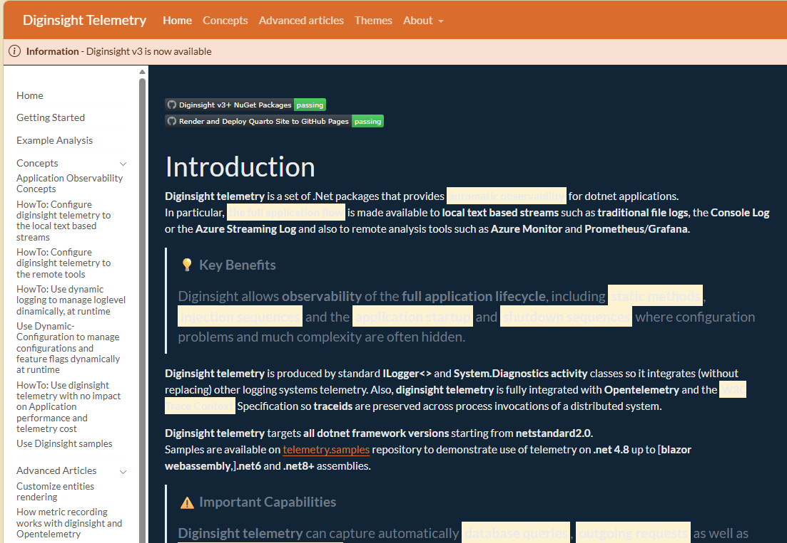

# ISSUE: Dark theme styles not applied to left sidebar and marked text highlight

**Date:** 2026-06-03  
**Author:** Dario Airoldi  
**Status:** Resolved  
**Severity:** Medium  
**Component:** Documentation site (Quarto) — `theme-dark.scss` / `styles.css`  
**Target Framework:** Quarto website (cosmo light/dark themes)  

---

## 📋 Table of Contents

1. [📝 Description](#-description)
2. [🔍 Context Information](#-context-information)
3. [🔬 Analysis](#-analysis)
4. [🔄 Reproduction Steps](#-reproduction-steps)
5. [✅ Solution Implemented](#-solution-implemented)
6. [📚 Additional Information](#-additional-information)
7. [✔️ Resolution Status](#️-resolution-status)
8. [🎓 Lessons Learned](#-lessons-learned)
9. [📎 Appendix](#-appendix)

---

## 📝 DESCRIPTION

When the Quarto documentation site is switched to its **dark theme**, two visual defects appear:

1. **Left sidebar (docked navigation) keeps light styling** — the docked left navigation panel does not pick up dark-theme colors, so it renders with a light background and dark/low-contrast links while the rest of the page is dark.
2. **Marked/highlighted text stays light** — text wrapped in `<mark>` (or `.mark`) keeps the light cream highlight (`#fff7d1`) that was forced globally with `!important`, making highlighted passages glare against the dark page and reducing readability.

### Error Message
```
N/A — visual/CSS theming defect, no runtime error or console output.
```



### Impact
- Inconsistent visual experience: left navigation looks "stuck" in light mode on dark pages.
- Highlighted (`<mark>`) text is hard to read on dark backgrounds due to the bright light-yellow fill.
- Reduced accessibility/contrast for users who prefer the dark theme.

---

## 🔍 CONTEXT INFORMATION

### Environment Details
- **Project:** Diginsight Telemetry documentation site
- **Generator:** Quarto website project (`_quarto.yml`)
- **Theme setup:** `light: [cosmo, theme-light.scss]`, `dark: [cosmo, theme-dark.scss]`
- **Global CSS:** `css: [styles.css, styles-callouts.css]`
- **Sidebar style:** `style: "docked"` (left navigation)

### Theme Switching Mechanism
| Property | Value |
|----------|-------|
| **Dark body class** | `body.quarto-dark` (toggled at runtime by Quarto JS) |
| **Light body class** | `body.quarto-light` |
| **Bootstrap highlight var** | `--bs-highlight-bg` |

The generated `Index.html` toggles the theme by adding/removing the `quarto-dark` / `quarto-light` classes on the `<body>` element:
```js
bodyEl.classList.add("quarto-dark");
bodyEl.classList.remove("quarto-light");
```

### Root Style Causing the Highlight Defect
```css
/* styles.css (before fix) */
:root {
  --bs-highlight-bg: #fff7d1;
}

mark,
.mark {
  background-color: #fff7d1 !important;   /* forced on ALL themes */
  color: inherit !important;
}
```

---

## 🔬 ANALYSIS

### Root Cause Analysis

#### Primary Cause — the "dark" theme was not actually dark, so `body.quarto-dark` was never applied
The real root cause was discovered through live browser inspection. The dark theme was configured as `dark: [cosmo, theme-dark.scss]`, but `theme-dark.scss` only overrode the **navbar** colors and never set a dark `$body-bg`. As a result the compiled `bootstrap-dark.min.css` still had a **light background**.

Quarto decides each theme's mode by the **brightness of the compiled background** and writes it onto the stylesheet link as `data-mode`. Because the dark theme compiled to a light background, Quarto emitted:
```html
<link href=".../bootstrap-dark.min.css" ... id="quarto-bootstrap" data-mode="light">
```
The theme-toggle JS adds `body.quarto-dark` **only** when the enabled sheet's `data-mode === "dark"`:
```js
const toggleBodyColorMode = (bsSheetEl) => {
  const mode = bsSheetEl.getAttribute("data-mode");
  if (mode === "dark") { bodyEl.classList.add("quarto-dark"); }
  else { bodyEl.classList.remove("quarto-dark"); }
};
```
Since the dark sheet was tagged `data-mode="light"`, toggling to "dark" set `localStorage` to `alternate` and loaded the dark bootstrap sheet, but **never added `body.quarto-dark`** to the `<body>`. Live inspection confirmed: after clicking the toggle, `document.body.className` still contained `quarto-light`.

#### Secondary Effect — `body.quarto-dark`-scoped CSS could never fire
Because `body.quarto-dark` was never present, **no** dark-scoped styling applied — neither Quarto's own dark sidebar styling nor the `body.quarto-dark` overrides that were added to `styles.css`. This is why the sidebar stayed light and `<mark>` kept its light cream fill even though the dark CSS existed and compiled correctly.

#### Error Manifestation
```
1. theme-dark.scss sets no dark $body-bg -> compiled dark sheet has light background.
2. Quarto tags the dark sheet data-mode="light".
3. User toggles to dark: localStorage=alternate, dark sheet loads,
   BUT body class stays quarto-light (data-mode !== "dark").
4. No body.quarto-dark -> no dark-scoped CSS applies.
5. Sidebar stays light; <mark> keeps #fff7d1 light highlight.
```

### Impact Assessment

| Category | Impact | Severity |
|----------|--------|----------|
| **Functionality** | None — purely cosmetic | Low |
| **Readability** | Highlighted text & sidebar links hard to read in dark mode | Medium |
| **User Experience** | Inconsistent theme application | Medium |

### Affected Workflows
1. ❌ **Dark theme reading**: Sidebar and highlighted text rendered with light styling.
2. ❌ **Highlight emphasis (`<mark>`)**: Bright highlight glares on dark pages.
3. ✅ **Light theme**: Unaffected — original light styling preserved.

---

## 🔄 REPRODUCTION STEPS

### Step-by-Step Reproduction
1. **Build/serve the site**:
   ```powershell
   quarto preview --no-browser --port 4848
   ```
2. **Open** any docs page with the docked left sidebar (e.g. `http://localhost:4848/`).
3. **Toggle** the theme switcher to **dark**.
4. **Observe**:
   - The left navigation panel remains light.
   - Any `<mark>`/highlighted text shows a bright light-yellow background.

### Affected Code Location
**File:** `styles.css`  
**Rules:** global `mark, .mark` highlight rule; missing dark sidebar overrides.
```css
/* PROBLEMATIC: forced on all themes */
mark,
.mark {
  background-color: #fff7d1 !important;
  color: inherit !important;
}
```

---

## ✅ SOLUTION IMPLEMENTED

### Fix Overview
The primary fix makes the dark theme **actually dark** by setting dark Sass defaults (most importantly `$body-bg`) in `theme-dark.scss`. This causes Quarto to tag the dark sheet `data-mode="dark"`, so the toggle correctly adds `body.quarto-dark` to the `<body>`. Once that class is present:
- Quarto's dark Bootstrap styling applies to the whole page (including a dark sidebar surface).
- The previously-added `body.quarto-dark`-scoped rules in `styles.css` (muted highlight, sidebar link colors) finally take effect.

Light theme behavior is preserved because all changes are scoped to the dark theme / `body.quarto-dark`.

### Code Changes

#### 0. Make the dark theme genuinely dark (PRIMARY FIX)
**Location:** `theme-dark.scss`
```scss
/*-- scss:defaults --*/
// Without a dark $body-bg the dark sheet is tagged data-mode="light",
// so the toggle never adds body.quarto-dark and no dark styling applies.
$body-bg: #1a1d20;
$body-color: #dee2e6;

$link-color: #6ea8fe;
$link-hover-color: #8bb9fe;

$light: #2b3035;
$dark: #dee2e6;
$secondary: #6c757d;

$border-color: #495057;
$code-color: #e685b5;

$navbar-bg: #8b6129;
$navbar-fg: white;
$navbar-hl: white;
```

#### 1. Theme-aware marked-text highlight
**Location:** `styles.css`
```css
/* Override Bootstrap highlight color to light yellow (light theme) */
:root {
  --bs-highlight-bg: #fff7d1;
}

mark,
.mark {
  background-color: #fff7d1 !important;
  color: inherit !important;
}

/* Dark theme: use a muted translucent highlight instead of the light yellow,
   so marked text stays readable on dark backgrounds */
body.quarto-dark {
  --bs-highlight-bg: rgba(255, 226, 138, 0.22);
}

body.quarto-dark mark,
body.quarto-dark .mark {
  background-color: rgba(255, 226, 138, 0.22) !important;
  color: inherit !important;
}
```

#### 2. Dark left sidebar (docked navigation) overrides
**Location:** `styles.css`
```css
/* Dark theme: ensure the left sidebar (docked navigation) follows dark styles */
body.quarto-dark #quarto-sidebar,
body.quarto-dark .sidebar.sidebar-navigation,
body.quarto-dark nav.sidebar-navigation {
  background-color: #2b3035 !important;
  border-color: #495057 !important;
}

body.quarto-dark #quarto-sidebar .sidebar-item a,
body.quarto-dark #quarto-sidebar .sidebar-item .sidebar-section .sidebar-item-text,
body.quarto-dark #quarto-sidebar a.sidebar-item-text,
body.quarto-dark .sidebar-navigation .sidebar-item a {
  color: #dee2e6 !important;
}

body.quarto-dark #quarto-sidebar .sidebar-item a:hover,
body.quarto-dark .sidebar-navigation .sidebar-item a:hover {
  color: #ffffff !important;
}

body.quarto-dark #quarto-sidebar .sidebar-item a.active,
body.quarto-dark .sidebar-navigation .sidebar-item a.active {
  color: #ffffff !important;
  font-weight: 600;
}
```

### Solution Features

#### ✅ Theme-scoped (no light-theme regression)
- All new rules are scoped to `body.quarto-dark`.
- Light theme keeps the original cream highlight and sidebar styling.

#### ✅ Readable dark highlight
- Translucent `rgba(255, 226, 138, 0.22)` keeps the "highlight" cue while letting the dark text/background show through.

### Transformation Examples

| Element | Light theme | Dark theme (after fix) |
|---------|-------------|------------------------|
| `<mark>` background | `#fff7d1` | `rgba(255, 226, 138, 0.22)` |
| Sidebar background | cosmo light | `#2b3035` |
| Sidebar link | default | `#dee2e6` (hover/active `#ffffff`) |

---

## 📚 ADDITIONAL INFORMATION

### Testing Recommendations
1. **Light theme** — confirm sidebar and `<mark>` are unchanged from before.
2. **Dark theme** — confirm sidebar is dark with light readable links, and highlighted text is legible.
3. **Theme toggle** — switch back and forth to verify no flash of incorrect styling.
4. **Cross-page** — verify on pages with the docked sidebar and on pages with highlighted text.

### Verification Performed
- `quarto render Index.md` completed successfully (only pre-existing, unrelated link-resolution warnings).
- Confirmed the regenerated `docs/Index.html` now tags the dark sheet `data-mode="dark"` (was `"light"`).
- Live browser inspection of the running preview confirmed that, after toggling to dark:
  - `document.body.className` now contains `quarto-dark`.
  - `body` background = `rgb(26, 29, 32)` (`#1a1d20`).
  - `#quarto-sidebar` background = `rgb(43, 48, 53)` (`#2b3035`) — no longer white.
  - `<mark>` background = `rgba(255, 226, 138, 0.22)` — no longer the light cream fill.
- Screenshot captured confirming the dark sidebar and readable highlights.

### Notes / Considerations
- Selectors target current Quarto DOM (`#quarto-sidebar`, `.sidebar-navigation`, `.sidebar-item`). A future Quarto upgrade could change these class names; revalidate after upgrades.
- The `!important` flags are required to override the global highlight rule and Bootstrap defaults.

---

## ✔️ RESOLUTION STATUS

### 🎯 **STATUS: RESOLVED**

**Resolution Date:** 2026-06-03  
**Resolved By:** Dario Airoldi  
**Resolution Type:** CSS fix (`styles.css`)

### Verification Checklist
- [x] **Code Changes Implemented**
  - [x] Theme-aware `mark`/`.mark` highlight for dark mode
  - [x] Dark sidebar background/border/link overrides
- [x] **Build**
  - [x] `quarto render` succeeds
  - [x] Compiled `docs/styles.css` includes new rules
- [x] **Visual verification**
  - [x] Dark sidebar verified in browser
  - [x] Dark highlight readability verified in browser

### Follow-up Actions
#### Short-term
- [x] Visually confirm in the running preview (`http://localhost:4848/`) in dark mode.

#### Long-term
- [ ] Re-check sidebar selectors after future Quarto version upgrades.

### Success Criteria
✅ **Achieved:**
- Dark theme no longer forces light highlight on `<mark>` text.
- Left docked sidebar restyled for dark theme.
- Light theme behavior preserved.

📋 **Pending Verification:**
- Final visual confirmation in browser.

---

## 🎓 LESSONS LEARNED

### What Went Wrong
1. **"Dark" theme was not dark**: `theme-dark.scss` only changed the navbar and never set a dark `$body-bg`, so Quarto tagged the dark sheet `data-mode="light"` and the toggle never added `body.quarto-dark`.
2. **Misleading symptom**: The defect looked like a CSS-override problem, but CSS-only fixes could never work while `body.quarto-dark` was absent.
3. **Global `!important` highlight**: Hard-coding the highlight color with `!important` was a secondary contributor for the highlight in any case.

### What Went Right
1. **Live browser inspection**: Reading `body.className` and computed styles in the running preview revealed the true root cause (missing `quarto-dark`) that source/compiled-CSS inspection alone had hidden.
2. **Quarto theme hook**: Once the theme was genuinely dark, the `body.quarto-dark` class provided a clean, reliable scoping mechanism.

### Improvements for Future
1. **Verify `data-mode`**: When a Quarto dark theme "doesn't apply", check that the generated dark `<link id="quarto-bootstrap">` has `data-mode="dark"`; if not, the theme isn't dark enough (set `$body-bg`).
2. **Confirm `body.quarto-dark` at runtime**: Before debugging dark CSS, confirm the class is actually present after toggling.
3. **Theme parity checklist**: When adding light-theme CSS, add the matching dark-theme rule at the same time.

---

## 📎 APPENDIX

### A. Source Materials
- **Issue note:** `overview.md` (this folder) — "dark styles do not apply to the left navbar; also, marked text should not be with light background in dark themes" + screenshot `image.png`.
- **Conversation:** Debugging/fix session that edited `styles.css`.

### B. Related Files
| File | Path | Changes |
|------|------|---------|
| `theme-dark.scss` | `theme-dark.scss` | **Primary fix** — added dark `$body-bg`/`$body-color` and dark Sass defaults so Quarto tags the dark sheet `data-mode="dark"` |
| `styles.css` | `styles.css` | Dark-scoped highlight + sidebar link rules (now effective once `body.quarto-dark` applies) |
| `_quarto.yml` | `_quarto.yml` | Theme/sidebar config (unchanged, referenced) |

---

**Document Version:** 1.0  
**Last Updated:** 2026-06-03  
