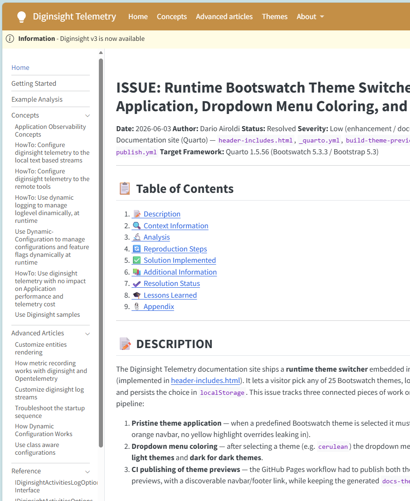

# ISSUE: Left navigation sidebar is not resizable on the Quarto documentation site

**Date:** 2026-06-03  
**Author:** Dario Airoldi  
**Status:** Resolved  
**Severity:** Low  
**Component:** Documentation site (Quarto) — `header-includes.html`  
**Target Framework:** Quarto website (cosmo light/dark themes, Bootstrap 5.3)  

---

## 📋 Table of Contents

1. [📝 Description](#-description)
2. [🔍 Context Information](#-context-information)
3. [🔬 Analysis](#-analysis)
4. [🔄 Reproduction Steps](#-reproduction-steps)
5. [✅ Solution Implemented](#-solution-implemented)
6. [📚 Additional Information](#-additional-information)
7. [✔️ Resolution Status](#️-resolution-status)
8. [🎓 Lessons Learned](#-lessons-learned)
9. [📎 Appendix](#-appendix)

---

## 📝 DESCRIPTION

The Quarto documentation site renders a **docked left navigation sidebar** that lists the
site sections (Home, Getting Started, Concepts, Advanced Articles, Reference, etc.). The
sidebar has a **fixed width** baked into Quarto's compiled Bootstrap grid, so longer entry
labels are truncated or wrap awkwardly and the reader cannot trade horizontal space between
the navigation column and the article body.

Users expect to be able to **drag the boundary** between the left navigation and the page
content to widen or narrow the navigation, the same way most documentation portals and IDEs
allow. No such affordance existed.

### Error Message
```
N/A — UX/layout limitation, no runtime error or console output.
```



### Impact
- Long navigation labels are clipped/wrapped at the fixed width, hurting readability.
- Readers cannot reclaim horizontal space for the article body on smaller laptops.
- No per-user persistence of navigation width across pages or sessions.

---

## 🔍 CONTEXT INFORMATION

### Environment Details
- **Project:** Diginsight Telemetry documentation site
- **Generator:** Quarto website (`type: website`, `output-dir: docs`)
- **CSS Framework:** Bootstrap 5.3 (Quarto-bundled `site_libs/bootstrap/bootstrap.min.css`)
- **Theme:** cosmo (light) / cosmo (dark) via `theme-light.scss` / `theme-dark.scss`
- **Layout mode:** `sidebar.style: "docked"` (configured in `_quarto.yml`)
- **Operating System:** Windows (authoring), any modern browser (consumption)

### Exception Details
| Property | Value |
|----------|-------|
| **Exception Type** | N/A (layout/UX limitation) |
| **Status Code** | N/A |
| **Activity ID** | N/A |

### Relevant Layout Definition
The docked sidebar width is governed by a CSS grid in the Quarto Bootstrap bundle:

```css
/* docs/site_libs/bootstrap/bootstrap.min.css (minified) */
body.docked .page-columns {
  display: grid;
  grid-template-columns:
    [screen-start] 1.5em
    [screen-start-inset page-start] minmax(50px, 100px)
    [page-start-inset] 50px
    [body-start-outset] 50px
    [body-start] 1.5em
    [body-content-start] minmax(500px, calc(1000px - 3em))
    [body-content-end] 1.5em
    [body-end] 50px
    [body-end-outset] minmax(50px, 100px)
    [page-end-inset] 50px [page-end] 5fr
    [screen-end-inset] 1.5em [screen-end];
}

body.docked .sidebar.sidebar-navigation {
  grid-column: screen-start / body-start; /* fixed-width navigation column */
}
```

The navigation column spans `screen-start / body-start`, and the columns up to
`body-start` are **hard-coded** (and duplicated across `docked`, `docked.fullcontent`,
`docked.slimcontent`, `docked.listing` variants), so the width is not user-adjustable.

---

## 🔬 ANALYSIS

### Root Cause Analysis

#### Primary Cause — width is locked in compiled CSS
Quarto bakes the docked sidebar width into the `grid-template-columns` of
`body.docked .page-columns` inside its compiled Bootstrap bundle. The bundle is generated
at render time and cannot be hand-edited safely, and there is **no Quarto front-matter
option** to make the docked sidebar resizable.

#### Why a Drag Handle Was Missing
Quarto ships a sidebar that can **collapse** (especially on mobile) but provides **no
resize grip** between the navigation and the content in docked desktop mode. Bootstrap 5
does not include a splitter component either, so the affordance has to be added by the site.

#### Error Manifestation
```
1. Site renders in docked mode (>= 992px viewport).
2. Sidebar column width is fixed by the compiled grid (minmax(50px,100px) tracks).
3. Long labels overflow/clip; user has no way to widen the column.
4. No persisted width → every page load uses the same fixed width.
```

### Impact Assessment

| Category | Impact | Severity |
|----------|--------|----------|
| **Functionality** | Navigation is usable but not adjustable | Low |
| **Readability** | Long labels clipped at fixed width | Medium |
| **User Experience** | No control over nav vs. content split; no persistence | Medium |

### Affected Workflows
1. ❌ **Browsing with long section names**: labels truncate/wrap at the fixed width.
2. ❌ **Reading on small laptops**: cannot trade nav width for article width.
3. ✅ **Mobile/collapsed navigation**: unaffected — collapse behavior is preserved.

---

## 🔄 REPRODUCTION STEPS

### Step-by-Step Reproduction
1. **Render the site**: 
   ```powershell
   quarto render
   ```
2. **Open any page** (e.g., `docs/Index.html`) in a desktop browser at width ≥ 992px.
3. **Observe the docked left navigation** rendered at a fixed width.
4. **Attempt to resize**: hover the boundary between the navigation and the content —
   there is no drag handle and the width cannot be changed.

### Affected Code Location
**File:** `header-includes.html` (site-wide `include-in-header` from `_quarto.yml`)  
**Mechanism:** No resizer markup/behavior existed; the docked grid width was inherited
verbatim from the Quarto Bootstrap bundle.

```css
/* Effective (unmodifiable) width source — Quarto bundle */
body.docked .page-columns { grid-template-columns: /* fixed tracks up to body-start */ ; }
```

---

## ✅ SOLUTION IMPLEMENTED

### Fix Overview
Add a **self-contained CSS + JavaScript resizer** to `header-includes.html`, which
`_quarto.yml` injects into every page via `format.html.include-in-header`. The solution
overrides the docked grid so the navigation width follows a CSS variable, injects a
draggable handle at the sidebar's right edge, and persists the chosen width in
`localStorage`.

### Code Changes

#### 1. Re-flow the docked grid through a CSS variable
**Location:** `header-includes.html` (new `<style>` block)

```css
@media (min-width: 992px) {
  /* !important wins over every Quarto docked variant regardless of specificity */
  body.docked .page-columns {
    grid-template-columns:
      [screen-start] 1.5em
      [screen-start-inset] var(--ds-sidebar-width, 220px)
      [page-start page-start-inset body-start-outset body-start] 1.5em
      [body-content-start] minmax(0, 1fr)
      [body-content-end] 1.5em
      [body-end body-end-outset page-end-inset page-end] minmax(0, 250px)
      [screen-end-inset] 1.5em [screen-end] !important;
  }
}
```

#### 2. Draggable handle + persistence
**Location:** `header-includes.html` (new `<script>` block)

```javascript
var KEY = "diginsight.sidebarWidth";
var MIN = 150, MAX = 600;

// Restore saved width ASAP to minimise layout flashing
var saved = readWidth();
if (saved) applyWidth(clamp(saved));

// Pointer drag updates --ds-sidebar-width live; pointerup persists to localStorage
handle.addEventListener("pointerdown", /* start drag */);
window.addEventListener("pointermove", /* clamp + applyWidth + reposition */);
window.addEventListener("pointerup",  /* persist via localStorage.setItem(KEY,...) */);
handle.addEventListener("dblclick",   /* reset to default width */);
```

### Solution Features

#### ✅ Draggable splitter
- A thin vertical handle is positioned at the sidebar's right edge.
- Highlights in the theme primary color on hover and while dragging.

#### ✅ Variable-driven width
- Width is clamped to `[150px, 600px]`, default `220px`.
- A single `!important` rule overrides **all** Quarto docked layout variants
  (`docked`, `docked.fullcontent`, `docked.slimcontent`, `docked.listing`).

#### ✅ Persistence and reset
- Chosen width saved to `localStorage` (`diginsight.sidebarWidth`) and restored early
  on each page to avoid layout flash.
- Double-click the handle clears the override and returns to the default width.

#### ✅ Responsive safety
- On viewports `< 992px` the handle is hidden, preserving Quarto's native
  collapsible-sidebar behavior.

### Transformation Examples

| Input | Output | Notes |
|-------|--------|-------|
| Drag handle right | Navigation widens, body narrows | Clamped at 600px |
| Drag handle left | Navigation narrows, body widens | Clamped at 150px |
| Double-click handle | Width resets to 220px | `localStorage` entry removed |
| Reload page | Last width restored | Read from `localStorage` |

---

## 📚 ADDITIONAL INFORMATION

### Testing Recommendations

#### Manual Verification
1. **Resize**: Render, open a page ≥ 992px, drag the handle — navigation resizes live.
2. **Persist**: Reload and navigate to another page — width is retained.
3. **Reset**: Double-click the handle — width returns to default and is cleared.
4. **Mobile**: Resize the browser below 992px — handle hidden, collapse still works.

#### Cross-Browser
- Verify pointer events on Chromium, Firefox, and WebKit.
- Confirm no horizontal scrollbars at min/max widths.

### Migration Considerations

#### ⚠️ Quarto re-render required
The behavior lives in `header-includes.html`; run `quarto render` to propagate it to all
HTML pages under `docs/`.

#### Interaction with the theme switcher
The resizer is independent from the existing Bootswatch theme switcher in the same file;
both coexist (theme switcher under the About menu, resizer at the sidebar edge).

### Performance Impact

| Operation | Before Fix | After Fix | Delta |
|-----------|------------|-----------|-------|
| **Initial render** | Fixed grid | Grid + 1 CSS var read | Negligible |
| **Drag interaction** | N/A | `requestAnimationFrame`-free direct style writes | Negligible |
| **Persistence** | N/A | 1 `localStorage` write on pointerup | Negligible |

### Security Considerations
- ✅ **No external input**: only a numeric width is read from `localStorage` and clamped.
- ✅ **No injection surface**: width applied via `style.setProperty`, never `innerHTML`.
- ✅ **Graceful degradation**: wrapped in `try/catch` for private-mode storage failures.

---

## REFERENCES

### Official Documentation
- [Quarto — HTML Sidebar / Page Layout](https://quarto.org/docs/output-formats/html-basics.html): docked sidebar configuration.
- [Quarto — Includes (`include-in-header`)](https://quarto.org/docs/output-formats/html-basics.html#includes): mechanism used to inject the resizer.
- [MDN — CSS Grid `grid-template-columns`](https://developer.mozilla.org/docs/Web/CSS/grid-template-columns): named-line grid used by the override.
- [MDN — Pointer events](https://developer.mozilla.org/docs/Web/API/Pointer_events): drag implementation.

### Related Issues
- **20260602.03-dark-theme-colors**: dark-theme sidebar styling fixes (same component).
- **20260602.04-Quarto-customization-analysis**: broader Quarto customization context.

### Code References

#### Modified Files
| File | Path | Changes |
|------|------|---------|
| **header-includes.html** | `header-includes.html` | Added resizable-sidebar `<style>` + `<script>` |

#### New Behaviors
- `--ds-sidebar-width` CSS variable drives the docked navigation width.
- `.ds-sidebar-resizer` drag handle with hover/drag highlight.
- `diginsight.sidebarWidth` `localStorage` key for persistence.

---

## ✔️ RESOLUTION STATUS

### 🎯 **STATUS: RESOLVED**

**Resolution Date:** 2026-06-03  
**Resolved By:** Dario Airoldi  
**Resolution Type:** Front-end enhancement (`header-includes.html` CSS + JS)

### Verification Checklist

- [x] **Code Changes Implemented**
  - [x] Docked grid overridden to use `--ds-sidebar-width`
  - [x] Drag handle injected and positioned at the sidebar edge
  - [x] Width persisted to and restored from `localStorage`
  - [x] Double-click reset implemented
- [x] **Testing**
  - [x] Single-page render (`quarto render Index.md`) succeeds and injects the resizer
  - [ ] Full-site render verified across all pages
  - [ ] Cross-browser manual check (Chromium / Firefox / WebKit)
- [ ] **Deployment**
  - [ ] Full `quarto render` and publish of `docs/`

### Follow-up Actions

#### Immediate (Priority 1)
- [ ] Run a full `quarto render` and visually verify on a representative page set.

#### Short-term (Priority 2)
- [ ] Cross-browser/manual QA at min/max widths and around the 992px breakpoint.

#### Long-term (Priority 3)
- [ ] Consider a keyboard-accessible resize affordance (ARIA separator + arrow keys).

### Success Criteria

✅ **Achieved:**
- Navigation width is draggable in docked desktop mode.
- Chosen width persists across pages and sessions.
- Mobile collapse behavior is preserved.

📋 **Pending Verification:**
- Full-site render and cross-browser QA.

---

## 🎓 LESSONS LEARNED

### What Went Wrong
1. **Framework defaults are rigid**: Quarto's docked sidebar width is compiled into the
   Bootstrap bundle with no front-matter knob to make it resizable.

### What Went Right
1. **Single injection point**: `header-includes.html` allowed a site-wide enhancement
   without touching individual pages.
2. **Specificity handled cleanly**: one `!important` grid override beats all docked
   variants without per-variant duplication.
3. **Progressive enhancement**: hidden below 992px, so native collapse behavior is intact.

### Improvements for Future
1. **Add keyboard accessibility** for the splitter (ARIA `separator` + arrow-key resize).
2. **Centralize site-wide UI tweaks** (theme switcher, resizer) with brief inline docs to
   keep `header-includes.html` maintainable.

---

## 📎 APPENDIX

### A. Configuration Reference (`_quarto.yml`)
```yaml
website:
  sidebar:
    style: "docked"   # the layout mode this fix targets
format:
  html:
    include-in-header: header-includes.html   # injection point for the resizer
```

### B. localStorage Keys
| Key | Purpose |
|-----|---------|
| `diginsight.sidebarWidth` | Persisted navigation width in pixels (clamped 150–600) |
| `diginsight.theme` | (existing) Bootswatch theme selection — unrelated, coexists |

---

**Document Version:** 1.0  
**Last Updated:** 2026-06-03  
**Next Review:** 2026-09-03
